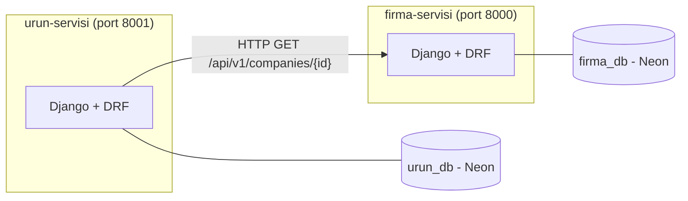

# urun-servisi

## Bu proje nedir, ne yapıyor

`urun-servisi`, ürün kayıtlarını (barkod, ad, hangi firmaya ait olduğu) yöneten bağımsız bir mikroservistir.
Ürün oluşturma, listeleme, detay görüntüleme ve silme işlemlerini bir REST API üzerinden sunar. Kendi
veritabanına sahiptir; ürün eklerken firmanın var olup olmadığını ve aktif olup olmadığını `firma-servisi`'ne
HTTP üzerinden sorar.

## Nasıl çalıştırılır

**Not:** Bu servisin çalışması için `firma-servisi`'nin de kurulu ve çalışıyor olması gerekir. Önce
[firma-servisi'nin README'sini](https://github.com/veliyener/firma-servisi) takip ederek onu kurup 8000
portunda çalıştırın, sonra bu adımlara devam edin.

### 1. Repoyu klonlayın

```bash
git clone https://github.com/veliyener/urun-servisi.git
cd urun-servisi
```

### 2. Sanal ortam oluşturun ve aktif edin

```bash
python -m venv .venv
.venv\Scripts\Activate.ps1          # Windows
```

### 3. Paketleri kurun

```bash
pip install -r requirements.txt
```

### 4. Neon üzerinden bir veritabanı oluşturun

[neon.tech](https://neon.tech) üzerinden ücretsiz bir hesap açıp **firma-servisi'ninkinden ayrı**, yeni bir
proje oluşturun. Projenin **Connection Details** kısmından bağlantı bilgilerinizi alın.

### 5. .env dosyasını oluşturun

Proje kök dizininde `.env.example` dosyasını kopyalayıp `.env` adıyla kaydedin, içindeki değerleri
4. adımda aldığınız gerçek Neon bilgileriyle doldurun:

DB_NAME=<neon-veritabani-adi>
DB_USER=<neon-kullanici-adi>
DB_PASSWORD=<neon-sifresi>
DB_HOST=<neon-host-adresi>
DB_PORT=5432
COMPANY_SERVICE_URL=http://localhost:8000/api/v1/companies


### 6. Veritabanı tablolarını oluşturun

```bash
python manage.py migrate
```

Bir hata alırsanız, büyük ihtimalle `.env` dosyanızdaki bağlantı bilgilerinden biri (özellikle `DB_PORT`)
yanlış girilmiştir.

### 7. Sunucuyu başlatın

```bash
python manage.py runserver 8001
```

**Dikkat:** Port numarasını (`8001`) belirtmeyi unutmayın, aksi hâlde `firma-servisi` ile aynı porta
(`8000`) çıkmaya çalışır ve çakışma yaşanır.

### 8. (İsteğe bağlı) Testleri çalıştırın

```bash
pytest
```

Testler gerçek Neon veritabanına değil, geçici bir SQLite veritabanına bağlanır; `firma-servisi`'nin
ayakta olmasına gerek duymaz çünkü servisler arası çağrılar test sırasında taklit edilir (mock'lanır).

### Port

Bu servis **8001** portunda çalışır: `http://127.0.0.1:8001`


## Mimari

İki bağımsız mikroservis vardır: `firma-servisi` ve `urun-servisi`. Her biri kendi veritabanına sahiptir,
birbirinin veritabanına doğrudan erişemez. Bu servis, ürün oluştururken `firma-servisi`'ne HTTP üzerinden
soru sorar ("bu firma var mı, aktif mi?"); bu istek 2 saniye zaman aşımına sahiptir, `firma-servisi`
ulaşılamaz durumdaysa `503` döner.



## Uçların listesi

| Adres | Metot | Ne yapar |
|---|---|---|
| `/api/v1/products` | GET | Ürünleri sayfalı olarak listeler, `?company_id=` ile filtrelenebilir |
| `/api/v1/products` | POST | Yeni ürün oluşturur (`X-User-Id` başlığı zorunludur) |
| `/api/v1/products/{id}` | GET | Tek bir ürünün detayını döner |
| `/api/v1/products/{id}` | DELETE | Ürünü siler |

## Aldığım kararlar ve gerekçeleri

### Firma unvanının ürüne kopyalanması

Ürün listesinde firma unvanını göstermek için üç yöntem değerlendirildi:

- **(a) Her istekte firma servisine sor:** Veri her zaman güncel olur, ama ciddi bir maliyeti var. Sayfa
  boyutu 20 olduğu için, bir liste isteği 20 ayrı HTTP çağrısı yapar (N+1 sorgu problemi). Üstüne, firma
  servisi çökerse ürün listesi de çöker — bağımlılık riski yaratır.
- **(b) Unvanı products tablosuna kopyala:** Ürün oluşturulurken firma unvanı da kaydedilir. Hızlı ve
  bağımsız çalışır, firma servisine her seferinde sormaya gerek kalmaz.
- **(c) Hiç gösterme, arayüz birleştirsin:** Servisler temiz kalır ama sorunu çözmez, sadece frontend'e
  devreder.

**Seçilen yöntem: (b).** (a) küçük bir kolaylık için ağır bir bedel getiriyor, (c) sorunu çözmüyor, sadece
taşıyor. (b) ise firma unvanının sık değişmeyen bir alan olması sayesinde makul bir takas sunuyor.
**Bilinen bedel:** Firma unvanı `firma-servisi`'nde değiştirildiğinde, bu değişiklik `urun-servisi`'ndeki
kopyaya otomatik yansımaz; gerçek bir sistemde bu, olay tabanlı (event-driven) bir mimari ile çözülür.

### Barkodun firma içinde tekil olması

Barkod, global değil firma içinde tekil tutuluyor. Barkod tek başına dünyada benzersiz bir kavram değil;
farklı firmalar kendi ürünlerini bağımsız olarak kodlayabilmeli. Asıl gereken tekillik, bir firmanın kendi
kataloğunda aynı barkodun tekrar etmemesi.

### Hata cevabının tek biçimi

Tüm hatalar `{"error": {"code", "message", "details"}}` biçiminde dönüyor, istemci hangi hatayla
karşılaştığını mesaj metnini yorumlamadan, sabit bir koda bakarak anlayabiliyor.

### Servis ulaşılamazken 503 dönmesi

İstek ve kodumuz doğru olduğu hâlde bağımlı olunan servise ulaşılamaması bizim hatamız değil; bu yüzden
`500` yerine `503` kullanılıyor. Bağlantı hatası, zaman aşımı ve firma servisinin kendi 500 hatası aynı
şekilde ele alınıyor.

### Diğer kararlar

- **Firma servisiyle HTTP iletişimi `clients/` katmanında izole:** Servis katmanı, `requests` kütüphanesinin
  varlığından habersiz; sadece kendi tanımladığı `CompanyClientError`'ı bilir.
- **ProductService, CompanyClient'ı dışarıdan da alabiliyor (bağımlılık enjeksiyonu):** Normal kullanımda
  kendi client'ını yaratır, testlerde sahte bir client verilebilir; bu, testlerin gerçek ağ çağrısı
  yapmadan çalışmasını sağlıyor.
- **Testler SQLite'a bağlanıyor, Neon'a değil:** `settings.py`, `pytest` ile çalıştırıldığını algılayıp
  veritabanını anlık olarak SQLite'a çeviriyor; testler hızlı ve izole çalışıyor.
- **Tip bildirimleri tüm fonksiyon imzalarına eklendi:** Fonksiyonların ne aldığı ve ne döndürdüğü, kodu
  çalıştırmadan anlaşılabiliyor.

## Dokümana Önerdiğim Eklemeler

Standartlar dokümanının 3.3 bölümünde karşılığı olmayan, bu hafta karşılaştığım üç durum kodu için öneriler:

- **204 No Content:** Bir kaynak başarıyla silindiğinde, dönecek bir gövde olmadığını belirtmek için
  kullanılmalı (örn. `DELETE /api/v1/products/{id}`).
- **503 Service Unavailable:** İstek ve kodumuz doğru olduğu hâlde, bağımlı olunan başka bir servise
  ulaşılamadığında veya zaman aşımına uğradığında kullanılmalı — bu bizim değil, bağımlı servisin geçici
  arızasıdır.
- **401 Unauthorized:** İsteğin kimlik bilgisi (bu projede `X-User-Id` başlığı) eksik veya geçersiz
  olduğunda kullanılmalı; sunucu isteği yapanın kim olduğunu bilmiyor demektir.